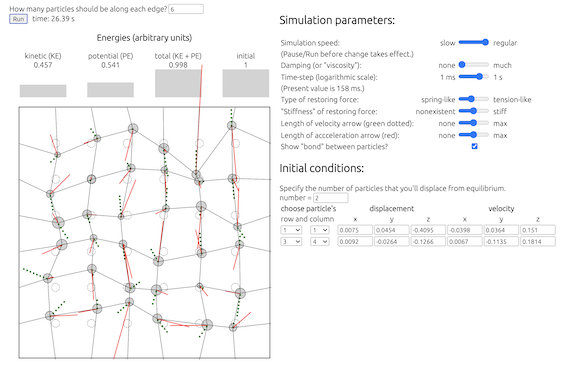
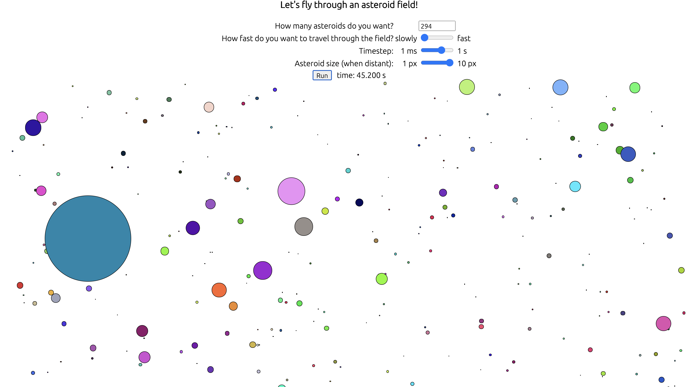
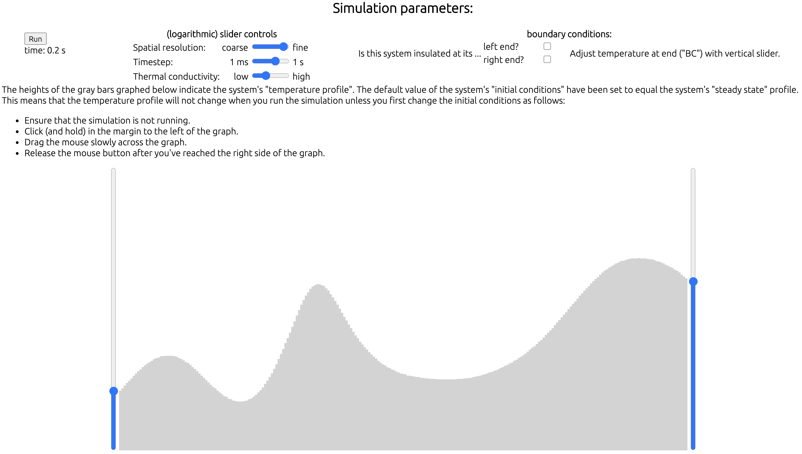

# Contents

[Heroku deployment](https://physics-sims.herokuapp.com)

[Introduction](#introduction)

[Drumhead](#drumhead)

[Asteroid field](#asteroid-field)

[Heat equation](#heat-equation)

# Introduction

[return to "Contents"](#contents)

[go to first sim ("Drumhead")](#drumhead)

This project consists of several [physics simulations](https://en.wikipedia.org/wiki/Physics_engine), each described below.  Although the project includes authentication
 with Redux, Express, and PostgreSQL, most of the activity occurs in the front end with JavaScript and React.  For each simulation the "parent" component is a class which utilizes state, life-cycle methods, and a clock built from the setInterval function, whereas the child components are all functional. The first and last simulations involve [solving differential equations numerically](https://en.wikipedia.org/wiki/Numerical_methods_for_ordinary_differential_equations).
 The most basic user-control for each of these simulations is the value of the requisite "time-step" (&Delta;*t*), for which the following pair of considerations must always be balanced:
 * Too large will lead to inaccurate calculations and choppy animations.
 * Too small will lead to a backup of the [message queue](https://developer.mozilla.org/en-US/docs/Web/JavaScript/EventLoop) which'll manifest itself by the clock's running slowly.

 Each of the first two simulations involves a collection of many objects, the position and angle for each of which are controlled dynamically by the css properties "top", "left", "z-index", and "transform".

```
import React from "react";
const Bond = ({x, y, z, x1, y1, width, size, dt}) => {
    if (x1 === null || y1 === null) return null;
    // The following two lines represent the two sides of a right triangle.
    const dx = x1 - x;
    const dy = y1 - y;
    // Pythagorean theorem
    const r = Math.sqrt(dx * dx + dy * dy);
    // "TOA" part of "SOHCAHTOA"
    const angle = Math.atan2(dy, dx) * 180 / Math.PI;
    return (
        <div className="line bond" style={{
            width:`${r}px`,
            left: `${x - r / 2}px`,
            top: `${y}px`,
            transform: `rotate(${angle}deg) translateX(${r / 2}px)`,
        }}/>
    )
}
export default Bond;
```

# Drumhead

[return to "Contents"](#contents)

[return to previous section ("Introduction")](#introduction)

[go to next sim ("Asteroid field")](#asteroid-field)

This simulates the three-dimensional motion of an *N* x *N* system of particles, which may be regarded as a model for the vibrating head of a drum.  This component of the project was inspired by PhET's [Normal Modes simulation](https://phet.colorado.edu/en/simulation/legacy/normal-modes), now largely defunct because of its reliance upon [Adobe Flash Player](https://en.wikipedia.org/wiki/Adobe_Flash_Player).



* Each particle is connected ("bonded") to its four neighbors or - if it resides along the edge - to the adjacent wall.  The [equilibrium](https://en.wikipedia.org/wiki/Mechanical_equilibrium) position for each particle is represented by a (stationary) dashed circle.
* Each particle's displacement is measured relative to its equilibrium position.  The positive directions are to the right (for *x*), down the screen (for *y*), or out of the screen (for *z*).
* The user may "tune" both the overall strength of the restoring forces and whether the restoring force is that of Hooke's-law springs or simply a mesh under tension.  [Viscous damping](https://en.wikipedia.org/wiki/Harmonic_oscillator#Damped_harmonic_oscillator) is also available to represent more realistic behavior.
* In addition to specifying the number of particles in the system, the user must specify the system's [initial conditions](https://en.wikipedia.org/wiki/Initial_condition), ie the extent to which any particle(s) is/are *not* in its/their equilibrium state(s) (motionless at the equilbrium position).  The user may shift arbitrarily many particles away from their equilibrium positions before running the simulation.
* The collection of *N*<sup>2</sup> particles satisfies [Newton's 2nd law](https://en.wikipedia.org/wiki/Newton%27s_laws_of_motion#:~:text=of%20Newtonian%20relativity.-,Newton's%20second%20law,direction%20of%20the%20applied%20force.&text=Thus%2C%20the%20net%20force%20applied,body%20produces%20a%20proportional%20acceleration.), which leads to a system of 6*N*<sup>2</sup> coupled first-order [ordinary differential equations](https://en.wikipedia.org/wiki/Ordinary_differential_equation).  The factor of 6 comes from 3 (the dimensionality of space) times 2 (the order of the derivative in Newton's 2nd law).

```
// Calculate (generalized) force, KE, PE, and E for a particular point in phase space.
// "rvs" is the triply nested array which contains the 3-dimensional positions ("r")
// and velocities ("v") for all of the particles.
Fs = rvs => {
    const { damping, n, T, springConstant } = this.state;
    let kConst = 1 - T;
    // This combo of a pair of JSON methods is a straightforward way to make
    // a deep clone of a nested object.
    let Fs = JSON.parse(JSON.stringify(this.state.zero6));
    // Initiallize two components of the potential energy: spring ("k") and stress ("T").
    let PEk = 0;
    let PET = 0;
    // Initialize the kinetic energy, which is summed for every particle in the system.
    let KE = 0;
    // Loop over rows in the drumhead.
    for (let i = 0; i < n; i++) {
        PEk += rvs[0][i][0] ** 2 + rvs[i][0][1] ** 2;
        PET +=
            rvs[0][i][1] ** 2 + rvs[0][i][2] ** 2 +
            rvs[i][0][0] ** 2 + rvs[i][0][2] ** 2;
        // loop over columns of array.
        for (let j = 0; j < n; j++) {
            for (let k = 0; k < 3; k++) {
                // time-derivative of position coordinate is simply the velocity
                Fs[i][j][k] = rvs[i][j][k + 3];
                // increment total kinetic energy by the square of the velocity components
                KE += rvs[i][j][k + 3] * rvs[i][j][k + 3];
            }
            // Determine the position of each particle's 4 neighbors
            // (some of which may be points on the wall).
            const rL = (i === 0)     ? [0, 0, 0] : rvs[i - 1][j];
            const rR = (i === n - 1)? [0, 0, 0] : rvs[i + 1][j];
            const rU = (j === 0)     ? [0, 0, 0] : rvs[i][j - 1];
            const rD = (j === n - 1)? [0, 0, 0] : rvs[i][j + 1];
            // Time-derivative of velocity coordinate for each particle is the force.
            // Force on each particle comes from its own velocity (if there is damping)
            // and from the positions of its neighbors.
            Fs[i][j][3] = - damping * rvs[i][j][3] + springConstant * (
                    kConst * (-2 * rvs[i][j][0] + rL[0] + rR[0])
                    + T * (-2 * rvs[i][j][0] + rU[0] + rD[0]));
            Fs[i][j][4] = - damping * rvs[i][j][4] + springConstant * (
                    kConst * (-2 * rvs[i][j][1] + rU[1] + rD[1])
                    + T * (-2 * rvs[i][j][1] + rL[1] + rR[1]));
            Fs[i][j][5] = - damping * rvs[i][j][5] + springConstant *
                        T * (-4 * rvs[i][j][2] + rL[2] + rR[2] + rU[2] + rD[2]);
            let dxR = rvs[i][j][0] - rR[0];
            let dyD = rvs[i][j][1] - rD[1];
            PEk += dxR * dxR + dyD * dyD;
            PET +=
                (rvs[i][j][0] - rD[0]) ** 2 + (rvs[i][j][2] - rD[2]) ** 2 +
                (rvs[i][j][1] - rR[1]) ** 2 + (rvs[i][j][2] - rR[2]) ** 2;
        }
    }
    // Now include pre-factors (0.5 and/or spring constant) needed for energies.
    KE /= 2;
    PEk *= springConstant * kConst / 2;
    PET *= springConstant * T / 2;
    const PE = PET + PEk;
    const E = PE + KE;
    return [Fs, KE, PE, E];
}
```

* The system of differential equations is solved numerically via a [Runge-Kutta](https://en.wikipedia.org/wiki/Runge%E2%80%93Kutta_methods) approach.  Because this is a 4th-order algorithm, the time-complexity is *O*(1/&epsilon;<sup>1/4</sup>), where &epsilon; is the desired accurary.

```
// With the present phase-space coordinate ...
// 1) ... finds the present generalized force,
// 2) ... propagates through phase-space for a particular amount of time (= dt/m),
// 3) ... and then returns the final value of the generalized force.
nextFs = (Fs, m) => {
    let rvs = JSON.parse(JSON.stringify(this.state.rvs));
    for (let i = 0; i < this.state.n; i++) {
        for (let j = 0; j < this.state.n; j++) {
            for (let k = 0; k < 6; k++) {
                rvs[i][j][k] += Fs[i][j][k] * this.state.dt / 1000 / m;
            }
        }
    }
    return this.Fs(rvs)[0];
}

// 4th-order Runge-Kutta method for propagating thru phase-space for a timestep dt
// This also sets state for the generalized force and the KE, PE, and E.
nextRvs = _ => {
    let all4 = this.Fs(this.state.rvs);
    let Fs1 = all4[0];
    let Fs2 = this.nextFs(Fs1, 2);
    let Fs3 = this.nextFs(Fs2, 2);
    let Fs4 = this.nextFs(Fs3, 1);
    let nextRvs = JSON.parse(JSON.stringify(this.state.rvs));
    for (let i = 0; i < this.state.n; i++) {
        for (let j = 0; j < this.state.n; j++) {
            for (let k = 0; k < 6; k++) {
                nextRvs[i][j][k] += (
                    Fs1[i][j][k] + Fs4[i][j][k] + 2 * (Fs2[i][j][k] + Fs3[i][j][k])
                    ) * this.state.dt/ 1000 / 6;
            }
        }
    }
    let E = all4[3];
    let Ei = (this.state.calcEi) ? this.state.Ei : E;
    this.setState({rvs: nextRvs, Fs: Fs1, KE: all4[1], PE: all4[2], E, Ei, calcEi: true});
}
```

* Bar graphs represent the system's [kinetic energy](https://en.wikipedia.org/wiki/Kinetic_energy) (associated with the particles' speeds), [potential energy](https://en.wikipedia.org/wiki/Potential_energy) (associated with the bonds' distortions), and [total energy](https://en.wikipedia.org/wiki/Energy).  In the absence of damping and aforementionned errors associated with the nonzero size of the time-step &Delta;*t*, the total energy *E* should be constant. Hence monitoring the [constancy of *E*](https://en.wikipedia.org/wiki/Conservation_law) is probably the best way to determine if &Delta;*t* is sufficiently small.
* Arrows represent the velocity- and acceleration-[vectors](https://en.wikipedia.org/wiki/Vector_(mathematics_and_physics)) for each particle.  Each arrow's direction is parallel to that of the relevant vector, and each arrow's length is proportional to the magnitude of the particular vector.

```
import React from "react";
const Vector = ({ type, x, y, vec, fac, dt }) => {
    let mag = fac * Math.sqrt(vec[0] * vec[0] + vec[1] * vec[1])/2;
    let angle = Math.atan2(vec[1], vec[0]) * 180 / Math.PI;
    return (
        <div className={`line ${type}`} style={{
                width:`${mag}px`,
                left: `${x - mag/2}px`,
                top: `${y}px`,
                transform: `rotate(${angle}deg) translateX(${mag/2}px)`,
        }}/>
    )
}
export default Vector;
```

# Asteroid field

[return to "Contents"](#contents)

[return to previous sim ("Drumhead")](#drumhead)

[go to next sim ("Heat equation")](#heat-equation)

This simulates the view from the front of a space ship as it flies through an endless field of asteroids, as inspired by the 1990's-era screensaver with which you may be familiar.



* The [perspective](https://en.wikipedia.org/wiki/Perspective_(geometry)) is as if the user is viewing the asteroids through a narrow cone, in which case the user's [solid-angle](https://en.wikipedia.org/wiki/Solid_angle) view is well approximated by a 2-dimensional plane. Each asteroid's apparent lateral position (*X* or*Y* expressed relative to the viewer's "fixation point" at the center of the screen) is proportional to the asteroid's actual lateral position (*x* or *y*) divided by 1 - *z*, in which *z* is the actual position of the asteroid relative to the user. Expressed differently: ["Closer objects appear larger."](https://en.wikipedia.org/wiki/Forced_perspective#:~:text=Forced%20perspective%20is%20a%20technique,of%20the%20spectator%20or%20camera.) Note that *z* = 1 corresponds to the asteroid striking the user, whereas *z* = 0 represents the asteroid's being far away.

* Each asteroid's (ReactJS) zIndex property is proportional to its *z*-coordinate, thereby ensuring that asteroids closer to the viewer will conceal any which are behind it.

```
import React from "react";
const Rock = ({ x, y, z, size, color, dt }) => {
    return (
        <div
            className="dot moving"
            style={{
                height:`${Math.round(size)}px`,
                width:`${Math.round(size)}px`,
                left: `${Math.round(x)}px`,
                top: `${Math.round(y)}px`,
                zIndex: `${Math.round(1000 * z)}`,
                backgroundColor: `${color}`,
                transitionDuration: `${dt / 1000}s`,
            }}>
        </div>
    )
}
export default Rock;
```

* Mindlessly using the geometric 1/*z* factor specified in the previous part leads to some unrealistic results, namely that the entire viewing area is covered with distant asteroids.  This is often called [Olber's dark night sky paradox](https://en.wikipedia.org/wiki/Olbers%27_paradox) when considered for the case of viewing stars from an Earth-bound vantage point.  Accordingly I replace 1/(1 - *z*) with    1/(1 - *z*) - 1/(1 + *z*), which leads to all asteroids' invisibility beyond the "distant" plane *z*= 0 (from which asteroids appear gradually/continuously, as if from a fog).

```
let size = this.state.width * (1 / (1 - z) - 1 / (1 + z));
let xpx = Math.round(this.nx * (rock.x/(1 - z) + 0.5) - size / 2);
let ypx = Math.round(this.ny * (rock.y/(1 - z) + 0.5) - size / 2);
```

* When an asteroid leaves the user's field of view, it is replaced by another asteroid at *z* = 0, with arbitrary velocity components and lateral coordinates (*x* and *y*).
```
rocks[i] = (this.isVisible(rocks[i])) ? rocks[i] : this.newRock(0);
```
* Each asteroid moves with a constant velocity, so css transitions (with [timing-function: linear](https://developer.mozilla.org/en-US/docs/Web/CSS/transition-timing-function)) are used to interpolate its positions between successive timesteps in order to allow for large values of &Delta;*t* without sacrificing animation smoothness.
```
.dot.moving {
  transition-property: all;
  transition-timing-function: linear;
}
```

# Heat equation

[return to "Contents"](#contents)

[return to previous sim ("Asteroid field")](#asteroid-field)

The [heat equation](https://en.wikipedia.org/wiki/Heat_equation) governs the time-dependence of the temperature profile of a one-dimensional system that is subject to user-controlled [boundary conditions](https://en.wikipedia.org/wiki/Boundary_value_problem#:~:text=A%20boundary%20value%20problem%20has,%2C%20thus%20the%20term%20%22initial%22) and [initial conditions](https://en.wikipedia.org/wiki/Initial_condition#Continuous_time).



* The heat equation is a [partial differential equation](https://en.wikipedia.org/wiki/Partial_differential_equation) that is first-order in time *t* and second-order in position *x*.  In addition to discretizing the time variable, I also do so with the position variable in order to obtain a [difference equation](https://en.wikipedia.org/wiki/Linear_difference_equation), which I solve through straightforward linear algebraic techniques.  The sizes of both the time-step (&Delta;*t*) and the position increment (&Delta;*x*) are controlled by [logarithmic](https://en.wikipedia.org/wiki/Logarithmic_scale) sliders.
```
handleLogDt = e => {
    let logDt = Number(e.target.value);
    this.setState({ logDt, dt: Math.round(10 ** logDt)});
}
```
* At either end of the system, the user may specify that the boundary condition be either [insulating](https://en.wikipedia.org/wiki/Neumann_boundary_condition) (ie no heat may pass through the boundary) or at a [specified temperature](https://en.wikipedia.org/wiki/Dirichlet_boundary_condition).
* The user creates an initial condition (ie, temperature profile) for this system by click-and-dragging from left to right across the bar graph, where tall skinny rectangular divs create a horizontal array of targets for the mouse events. Vertical mouse-positions may be extracted from the offsetY property of e.nativeEvent.

```
for (let j = 0; j < this.state.n; j++) {
     stripes.push(
        <div key={`${j}`}
            id={`${j}`}
            className="stripe"
            name={`${j}`}
            onMouseLeave={this.handleMouseLeave}
            style={{
                height:`${this.height}px`,
                left: `${j * this.state.dx}px`,
                width:`${this.state.dx}px`
            }}
        >
        </div>
    )
}

handleMouseLeave = e => {
    if (!this.state.mousePressed) return;
    let Ts = [...this.state.Ts];
    let col = Number(e.target.id);
    Ts[col] = (1 - e.nativeEvent.offsetY / this.height);
    // For all but 1st column, take avg of two heights
    if (col > 0) Ts[col] = (Ts[col] + Ts[col - 1]) / 2;
    this.setState({ Ts, time: 0 });
}
```
* I solve the difference equation via the [Crank-Nicolson method](https://en.wikipedia.org/wiki/Crank%E2%80%93Nicolson_method), which requires solving a [tridiagonal](https://en.wikipedia.org/wiki/Tridiagonal_matrix) set of linear equations.  The accuracy of this [implicit](https://en.wikipedia.org/wiki/Explicit_and_implicit_methods) method is 2nd order in time, so the time-complexity is *O*(1/&epsilon;<sup>1/2</sup>), where &epsilon; is the desired accuracy.  In order to eliminate unphysical [Gibbs-phenomenon](https://en.wikipedia.org/wiki/Gibbs_phenomenon) behavior at the boundaries, I use a two-timestep average to smooth out the oscillations.

```
tridiag = _ => {
    let { n, Ts, leftIns, leftT, rightIns, rightT } = this.state;
    let alpha0 = this.state.alpha * this.state.dt * (n + 1) * (n + 1) / 1000;
    // diagonal element of matrix to be inverted
    let b = new Array(n).fill(1 + alpha0);
    // off-diagonal elements of matrix to be inverted
    let a = new Array(n).fill(-alpha0/2);
    let c = new Array(n).fill(-alpha0/2);
    // inhomogeneous part of matrix equation
    let r = new Array(n);
    // solution of matrix equation
    let u = new Array(n);
    // working vector for solution algorithm
    let g = new Array(n);
    // adjustments for the which type of BC is used
    if (this.state.leftIns ) b[0]     -= alpha0/2;
    if (this.state.rightIns) b[n - 1] -= alpha0/2;
    r[0] = Ts[0] + (Ts[1] - 2 * Ts[0] + (leftIns ? Ts[0] : 2 * leftT)) * alpha0 / 2;
    r[n-1] = Ts[n-1]+(Ts[n-2]-2*Ts[n-1]+(rightIns ? Ts[n-1]:2*rightT)) * alpha0 / 2;
    let bet = b[0];
    u[0] = r[0]/bet;
    // decomposition and forward substitution
    for (let i = 1; i < n; i++) {
        g[i] = c[i - 1] / bet;
        bet = b[i] - a[i] * g[i];
        if (i < n - 1) r[i] = Ts[i] + ((Ts[i - 1] - Ts[i]) - (Ts[i] - Ts[i + 1])) * alpha0 / 2;
        u[i] = (r[i] - a[i] * u[i - 1]) / bet;
    }
    // backsubstitution
    for (let i = n - 2; i >= 0; i--) {
        u[i] -= g[i + 1] * u[i + 1];
    }
    // 2-timestep averaging in order to smooth out Gibbs-phenomenon oscillations
    for (let i = 0; i < n; i++) {
        u[i] = (u[i] + Ts[i]) / 2;
    }
    this.setState({Ts: u});
}
```

[return to "Contents"](#contents)

[go to beginning of this sim ("Heat equation")](#heat-equation)

I hope that you enjoy learning about our universe!
